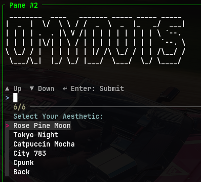
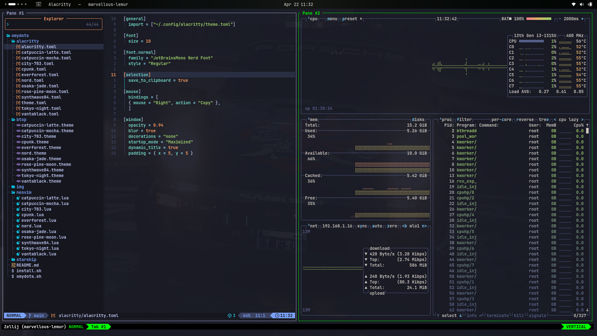
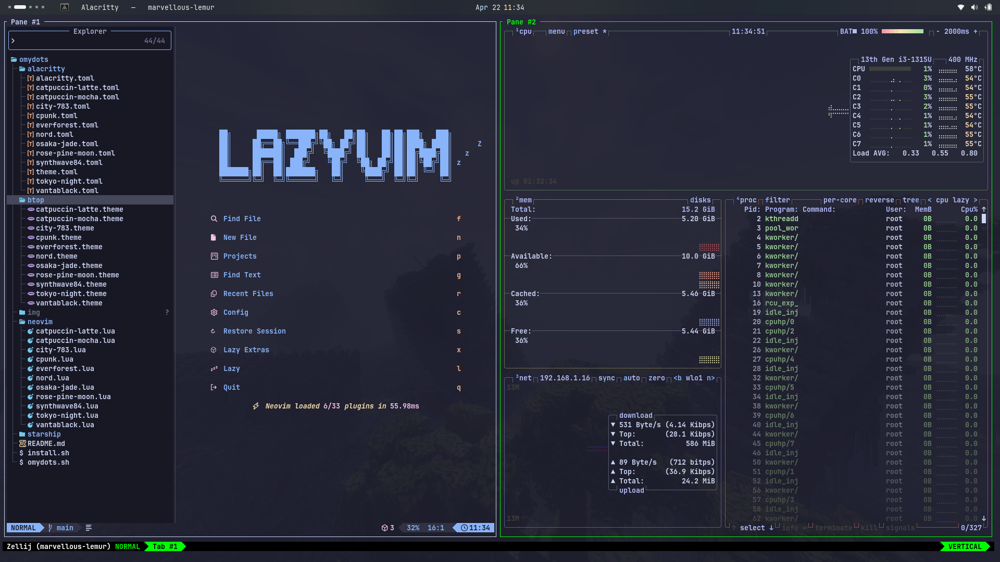

# 🎨 omydots  

> A minimalist, lightning-fast theme switcher and configurator for the modern terminal.

<p align="center">
  
</p>

**omydots** is a lightweight theme manager designed for users who love to switch vibes instantly. Instead of manually editing config files, `omydots` uses a "pointer" system to swap themes across multiple applications simultaneously using a beautiful `fzf` interface. It is compatible with all Linux distros and MacOS.

---

Application,Configuration Location
| App Name          | Config Files                                      |
|-------------------|---------------------------------------------------|
| Alacritty   | `~/.config/alacritty`<br>`~/.config/alacritty/alacritty.toml`   |
| **Neovim**     | `~/.config/nvim/lua/plugins/colorscheme.lua`                           |
| **Btop**   | `~/.config/btop/btop.conf`<br>`~/.config/btop/themes`                                 |
| **Starship**   | `~/.config/starship.toml`<br>`~/.config/starship/`                                 |
| **Zellij**   | `~/.config/zellij/config.kdl`                                 |
| **Opencode**   | `~/.config/opencode/tui.json`                                 |

---

## 🛠️ Installation

### 1. Prerequisites
Ensure you have the following installed:
* `fzf` (The fuzzy finder)
* `git`
* `nerfonts` (nerdfonts.com)

### 2. Clone and Install
Clone the repository and run the install script. 

```bash
git clone https://github.com/hoareaupascal/omydots.git
cd omydots
./install.sh
```
### 3. Preview
<details>
  <summary>📸 Click to view Screenshots</summary>
  
  <p align="center">
    
    <br>
    <em>Tokyonight</em>
  </p>

  <p align="center">
    
    <br>
    <em>Catpuccin Mocha</em>
  </p>
</details>
